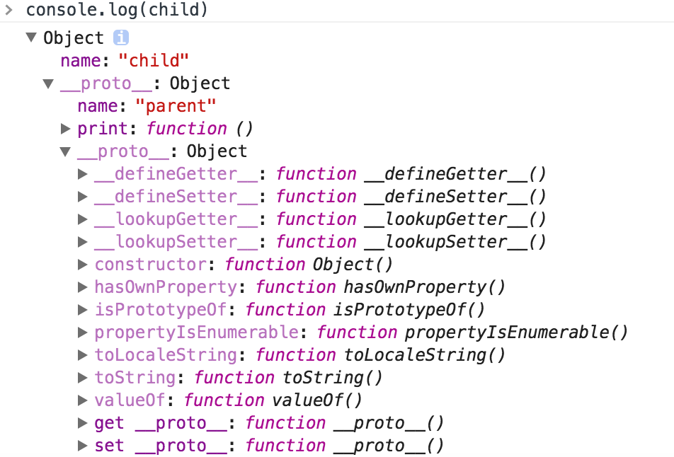
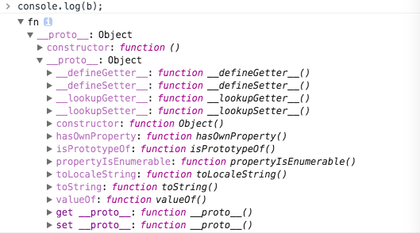

# Javascript 
Javascript火了！貌似只要是对性能没有高要求的事都可以让JS来做。尤其是面向客户的端应用，无论PC、Web、Android/iOS都可以看到Javascript的身影，再加上Node.js在服务端攻城掠地，好像JS真的要一统江湖。
JS是一门基于原型、函数先行的语言，是一门多范式的语言，它支持面向对象编程，命令式编程，以及函数式编程。它提供语法来操控文本，数组，日期以及正则表达式等，不支持I/O，比如网络，存储和图形等，但这些都可以由它的宿主环境提供支持。接下来我们逐条分析JS的这些特性。

## ECMAScript
ECMAScript是一种由Ecma国际（前身为欧洲计算机制造商协会）通过ECMA-262标准化的脚本程序设计语言。当前正在制定中的版本是第六版，即 ES6。当然部分浏览器已经实现了ES6标准的Javascript。在使用React-Native开发的过程中也会用到一些ES6的新特性。具体内容可以参考 [深入浅出ES6](http://www.infoq.com/cn/es6-in-depth/) 。

## 数据类型
JS的原始数据类型（Primitive Types）包括undefined、null、boolean、string、number、object。ES6增加了Symbol类型，此处不讨论。奇怪的地方有两个：
一、在浏览器调用 “typeof null”时，浏览器返回的是”object“；
二、虽然Javascript文档中并没有将function作为基本类型，但是当在浏览器中调用”typeof new Function()”时返回的是”function”。
其他的复杂类型都是继承自object，例如Array、Date对象。而且可以使用String()、Number()、Boolean()装载一个数据对象。
虽然傻傻分不清楚，但是通常情况下不妨碍大家使用。
## 原型链
JS本质上只有一种结构，那就是：对象。在JS中，每个对象都有一个指向它的原型（prototype）对象的内部链接。这个原型对象又有自己的原型，直到某个对象的原型为 null 为止（也就是不再有原型指向），组成这条链的最后一环。这种一级一级的链结构就称为原型链（prototype chain）。
```
var parent = {
	name:’parent’,
	print:function(){
		console.log(this.name);
	}
}
var child = Object.create(parent);
child.name = ‘child’;
child.print(); // child
```

可以从输出平台看到一个通过 `__proto__` 属性串联起来的原型链： `child.__proto__  —> parent.__proto__ —> Object.prototype` 。
我们用同样的方法，再来检查一下function的原型链。从控制台的输出可以看到，function最终仍然指向Object.prototype。
```
var Foo = function(){};
var b = new Foo();
console.log(b);
```

如果你已经懵了，可以看这篇文章： [javascript继承的设计思想](http://www.ruanyifeng.com/blog/2011/06/designing_ideas_of_inheritance_mechanism_in_javascript.html)
## 函数
函数在JS的世界里是一等公民。首先函数继承自对象，可以像对象一样传递和赋值，同时函数还有一些特殊“待遇”。
## 闭包
## This
